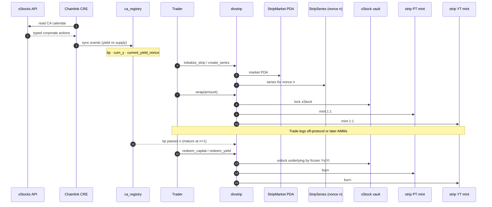
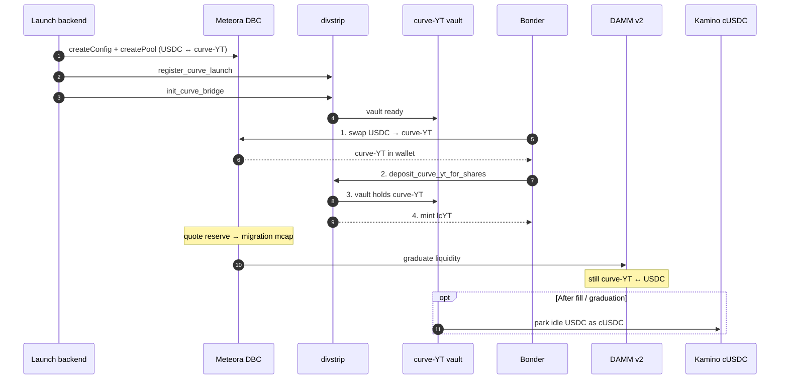

# DivStrip

### A new DeFi building block for tokenized stocks on Solana

**Split the equity. Isolate the dividend window. Price it. Compose it.**

DivStrip turns a single **xStock** into two tradable legs — **strip PT** (capital) and **strip YT** (yield for one **dividend window**) — backed by on-chain corporate-action history so redemptions match **real coupon math**, not a blended wallet multiplier.

| | |
|:--|:--|
| **What you get** | **Strip PT / strip YT** — composable SPL tokens tied to a **yield nonce** (coupon step *n → n+1*) |
| **What DivStrip adds** | One place to **split**, **discover price** (Meteora DBC → DAMM **curve-YT**), and **vault** (**lcYT**) — then use **YT as a primitive** in other dedicated DeFi (auctions, options, lending, …) |
| **This repo** | Anchor programs (`ca_registry`, `divstrip`), Chainlink **CRE** workflow, **web desk** (`web/`) |

> **Demo disclaimer:** Run DivStrip on a **local [Surfpool](https://docs.surfpool.run/) fork** only (mainnet *state*, **local RPC**). Not production mainnet. Balances on the fork are not real funds. **Judges → [Quick start](#judge-quick-start)** (~3 min after install).

> **Repo note:** Clone folder may be named `orange`; env vars use the `ARANCIO_*` prefix for local Surfpool/RPC.

---

## Why DivStrip exists

**Tokenized stocks are one blob.** xStocks (and similar wrappers) expose a **single balance** whose multiplier mixes **cash dividends**, **splits**, and other **corporate actions (CAs)**. That is fine for “own the stock,” but it breaks DeFi that needs a **clean, isolated claim**:

- You cannot read **“only the next dividend”** off-chain in a form you can **trust at redemption**.
- You cannot **mark the dividend window to market** without inventing your own CA oracle.
- **No canonical on-chain history** of yield vs supply events — so downstream protocols (auctions on the coupon, dividend options, lending against YT, etc.) have **nothing durable to hook into**.

**DivStrip fixes the data layer, then the product layer.**

1. **Chainlink CRE** + **`ca_registry`** — ingest xStocks CAs, tag **yield** vs **supply**, append an auditable timeline (`cum_y`, **yield nonces**). Each **strip series** is anchored to **one window** so **YT redemption** uses the **frozen coupon** for that window (`1 − Yₛ/Yₜ` from registry), not today’s blended multiplier.
2. **`divstrip`** — **wrap** xStock → **PT + YT**; **redeem** after maturity; optional **curve-YT** market + **lcYT** vault.
3. **Meteora DBC** — **price discovery** for “how the market values this dividend window” (**curve-YT**, USDC pair) before/ alongside stripping.

**Strip YT / curve-YT are a new object in stock-token DeFi:** a **window-specific yield claim** (or its traded surrogate) you can plug into **dedicated** primitives — not a generic “points” token.

```
  xStock (mixed CA exposure)
       │
       ├── ca_registry ◄── CRE ◄── xStocks API   (typed history, per window)
       │
       ├── wrap ──► strip PT  (capital leg)
       │            strip YT  (dividend-window leg) ──► compose: auctions · options · lending · …
       │
       └── curve path ──► Meteora curve-YT (USDC) ──► DivStrip vault ──► lcYT
```

---

## External integrations

What each partner does in **this** stack (logos in [`docs/diagrams/brand/`](docs/diagrams/brand/)).

### xStocks

<p align="left">
  
</p>

**Role:** Tokenized mega-cap equities on Solana (the **underlying** you strip).

**In DivStrip:** The mint you **wrap** into PT/YT; corporate-action calendar is read from the **xStocks API** and mirrored on-chain (see CRE + `ca_registry`). DivStrip does not replace xStocks — it **structures** exposure on top of them.

---

### Chainlink CRE

<p align="left">
  
</p>

**Role:** [Chainlink Runtime Environment (CRE)](https://docs.chain.link/cre) — off-chain workflows that **deliver verified data and writes on-chain**.

**In DivStrip:** Workflow [`xstocks-ca-sync`](cre/orange-cre/xstocks-ca-sync/) classifies xStocks CAs (**yield** / **supply** / other) and updates **`ca_registry`**, so DivStrip knows **which dividend window** a series is and **which cum_y values freeze** at redeem. Without this layer, YT would be priced against **opaque multipliers**, not **corporate actions**.

---

### Meteora

<p align="left">
  
</p>

**Role:** **Dynamic Bonding Curve (DBC)** → **DAMM v2** liquidity for new assets.

**In DivStrip:** **curve-YT** pools (USDC quote) **discover market price** for a dividend window. That is separate from **strip YT** (on-chain escrow claim). Traders swap on Meteora, then **deposit curve-YT** into DivStrip for **lcYT** shares. **Graduation** (pool fill) and **strip maturity** (registry tip) are **different clocks**.

---

## Chainlink CRE & `ca_registry`

CRE is the **oracle spine** for honest strips: xStocks alone does not give you an on-chain, window-indexed dividend ledger.

| Piece | Purpose |
|-------|---------|
| **`xstocks-ca-sync`** (CRE workflow) | Poll xStocks → map `caType` → **yield nonce** / `cum_y` / `cum_s` → write **`ca_registry`** |
| **`ca_registry`** program | Canonical **CA log** per mint: tip, events, frozen factors for DivStrip redeem |
| **`divstrip`** program | Consumes registry at **series create** and **redeem**; never guesses coupon from spot multiplier |

**Learn CRE:** [Overview](https://docs.chain.link/cre) · [Project configuration](https://docs.chain.link/cre/reference/project-configuration) · [CRE CLI](https://docs.chain.link/cre/reference/cli) · [Workflow README](cre/orange-cre/xstocks-ca-sync/README.md)

**Judge demo vs CRE:** The [quick start](#judge-quick-start) **does not require CRE running**. `./scripts/deploy-surfpool.sh` **seeds `ca_registry`** (same as our live demo when Chainlink was offline). Install CRE only to simulate/broadcast yourself: `./scripts/run-cre-xstocks-sync.sh`.

---

## Judge quick start

**Goal:** Surfpool running → programs deployed → your wallet funded → desk at [http://127.0.0.1:3000/app](http://127.0.0.1:3000/app).

**Need more detail?** Full guide: [`REPRODUCE_SURFPOOL.md`](REPRODUCE_SURFPOOL.md) (WSL RPC, CRE sync, troubleshooting).

### 0 — Install once

| Tool | Version (repo) | Install |
|------|----------------|---------|
| **Node.js + npm** | 18+ (npm 9+) | [nodejs.org](https://nodejs.org/) |
| **Rust + Solana CLI** | 3.1.10 | [Solana install](https://docs.anza.xyz/cli/install) |
| **Anchor** | 1.1.2 | [Anchor avm](https://www.anchor-lang.com/docs/installation) (`avm install 1.1.2 && avm use 1.1.2`) |
| **Surfpool** | 1.5.0 | [Surfpool docs](https://docs.surfpool.run/) |
| **Chainlink CRE CLI** *(optional)* | — | [CRE CLI](https://docs.chain.link/cre/reference/cli) — **not required for the judge demo** |

```bash
git clone <this-repo> divstrip && cd divstrip
npm install
npm install --prefix web
```

**Chainlink CRE:** In production, [`xstocks-ca-sync`](cre/orange-cre/xstocks-ca-sync/) pushes xStocks corporate actions into `ca_registry`. For the **Surfpool demo**, `./scripts/deploy-surfpool.sh` **seeds the registry for you** — you do **not** need the `cre` CLI running (same as our live demo). Install CRE only if you want to simulate or broadcast the workflow yourself ([`xstocks-ca-sync` README](cre/orange-cre/xstocks-ca-sync/README.md), `./scripts/run-cre-xstocks-sync.sh`).

### 1 — Wallet (before deploy)

Use **Phantom** or **Backpack** (either is fine for local demo).

1. Install the browser extension ([Phantom](https://phantom.app/) · [Backpack](https://backpack.app/)).
2. Turn on **Developer mode** in wallet settings (Phantom: *Settings → Developer Settings*; Backpack: *Settings → Developer mode*).
3. Add a **custom RPC** pointing at Surfpool:

   | Field | Value |
   |-------|--------|
   | **RPC URL** | `http://127.0.0.1:8899` |
   | **Network** | Solana |

   **WSL2:** if the browser is on Windows and Surfpool runs in Linux, use your WSL IP instead of `127.0.0.1` (see [`REPRODUCE_SURFPOOL.md`](REPRODUCE_SURFPOOL.md)).

4. Copy your wallet **public address** (base58). You will pass it to the deploy script so the fork funds **your** wallet with demo SOL, USDC, and desk xStocks.

The desk **Connect wallet** button supports **Phantom** and **Solflare**. If you use Backpack for RPC, connect with **Phantom or Solflare** in the app to sign transactions (same custom RPC).

### 2 — Three terminals

Leave **Terminal A** running the whole time.

**Terminal A — start Surfpool** (mainnet fork, in-memory DB = clean slate each run):

```bash
ARANCIO_SURFPOOL_DB=:memory: ./scripts/start-surfpool.sh
```

Wait until RPC is up (`http://127.0.0.1:8899`). No exit prompt is normal — keep this terminal open.

**Terminal B — deploy + seed registry + fund your wallet** (replace with your address):

```bash
./scripts/deploy-surfpool.sh <Address-To-Fund>
```

This script: points `solana` at Surfpool, builds & deploys `ca_registry` + `divstrip`, **seeds `ca_registry` (no Chainlink CRE process needed)**, and funds your wallet on the fork.

First run includes `anchor build` (can take several minutes). Later:

```bash
ARANCIO_SKIP_BUILD=1 ./scripts/deploy-surfpool.sh <Address-To-Fund>
```

**Terminal C — web desk:**

```bash
npm run web
```

Open [http://127.0.0.1:3000](http://127.0.0.1:3000) → **Open strip desk** → connect wallet → try **Split** or **curve-YT** on `/app`.

---

## Local Test RPC

```bash
./scripts/start-surfpool.sh
# or: ARANCIO_SURFPOOL_DB=:memory: ./scripts/start-surfpool.sh
```

Tests use `ARANCIO_RPC_URL` when set, otherwise `http://127.0.0.1:8899`.

```bash
# Workspace smoke + immutable vault config
npm run mocha -- tests/arancio.ts --grep "workspace smoke"

ARANCIO_SURFPOOL_DB=:memory: ./scripts/start-surfpool.sh
ARANCIO_RPC_URL=http://127.0.0.1:8899 \
  npm run mocha -- -t 1000000 tests/arancio.ts \
  --grep "configuration|named vault|immutable"

# CA registry + CRE sync
ARANCIO_RPC_URL=http://127.0.0.1:8899 \
  npm run mocha -- -t 180000 tests/ca-registry.ts

npm run test:anchor
```

## On-chain programs (DivStrip stack)

| Program | Role in DivStrip |
|---------|------------------|
| **`ca_registry`** | CA timeline (yield vs supply, `cum_y`, yield nonces) — CRE-fed |
| **`divstrip`** | Core protocol: PT/YT strip, wrap/redeem, curve-YT bridge, **lcYT** vault |
| `yield_cusdc` | Optional local cUSDC mint for tests (demo desk uses Kamino on fork) |
| `arancio` | Optional legacy vault program — **not required** for the DivStrip judge demo |

## Architecture (demo)

Interactive versions of these diagrams live on the landing page at
[`/`](web/) → **Architecture** (`#architecture`).

Diagram SVGs (with brand marks) live in [`docs/diagrams/`](docs/diagrams/).
GitHub Mermaid strips `` tags, so the logo-heavy maps are static SVGs below;
sequence diagrams stay as Mermaid.

### 1 — Split path: oracle → contracts → redeem

Users deposit an xStock and receive **strip PT** (capital) + **strip YT** (yield)
for one yield nonce. Chainlink CRE reads the **xStocks API**, labels each CA, and
writes `ca_registry` so DivStrip freezes the right coupon — not raw multiplier noise.



**On-chain pieces (split)**


### 2 — Curve market: DBC, vault, graduation

**curve-YT** is a Meteora discovery token (USDC pair) — not strip YT.
Bonders **swap USDC → curve-YT on DBC**, then **deposit curve-YT into the DivStrip
vault** and receive **lcYT** shares. The vault does **not** pull curve-YT from
Meteora directly — the trader’s wallet is the bridge hop.
Graduation (DBC → DAMM) and strip maturity are **different clocks**.
Idle vault USDC can later park in **Kamino cUSDC**.



**System map (curve + graduation)**


### Two clocks

| Clock | What ends it | Where |
|-------|----------------|-------|
| Bonding / graduation | Quote fill hits migration mcap | Meteora DBC → DAMM |
| Strip maturity | Registry tip passes yield nonce n | DivStrip + `ca_registry` |

## Web desk

After [Judge quick start](#judge-quick-start): **`npm run web`** → [http://127.0.0.1:3000](http://127.0.0.1:3000).

- `/` — overview, **Architecture** diagrams, curve-YT lifecycle, CRE story
- `/app` — Split xStock → PT/YT, launch curve-YT on Meteora DBC, vault buy/sell

**Wallets:** connect **Phantom** or **Solflare** in the app; set **custom RPC** `http://127.0.0.1:8899` (Phantom/Backpack developer settings). Fund via `./scripts/deploy-surfpool.sh <Address-To-Fund>`.

Meteora curve: initial mcap ≈ f(fair coupon `1 − Yₛ/Yₜ`), migration ≈ 10×, quote **USDC**.
Requires Surfpool `--network mainnet` so DBC program
`dbcij3LWUppWqq96dh6gJWwBifmcGfLSB5D4DuSMaqN` is on the fork.

Vault-side yield park uses **Kamino** main-market cUSDC (users still trade USDC on the desk).

**Extended setup:** [`REPRODUCE_SURFPOOL.md`](REPRODUCE_SURFPOOL.md)
