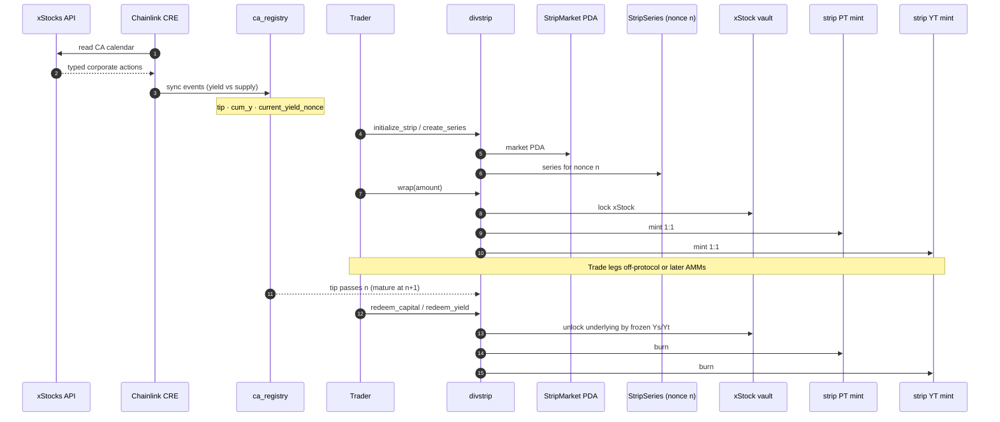
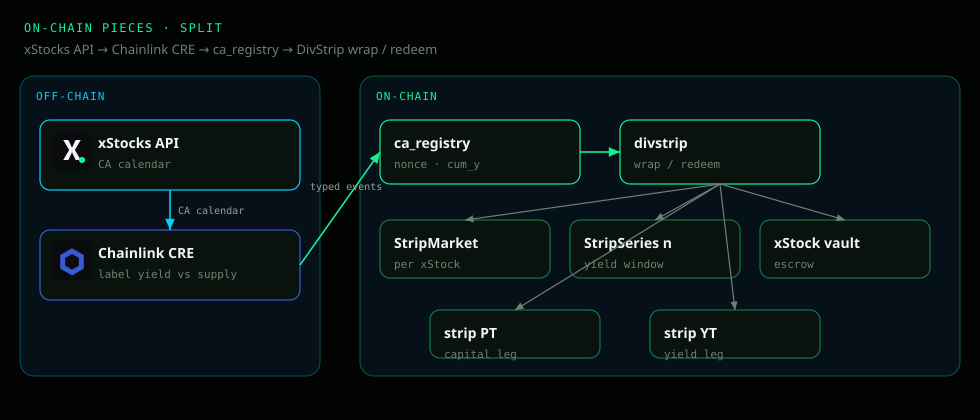
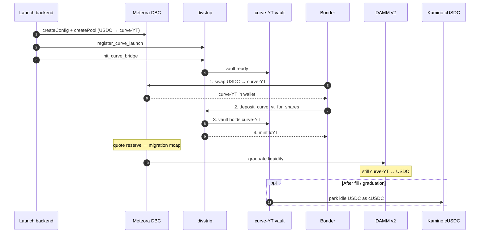
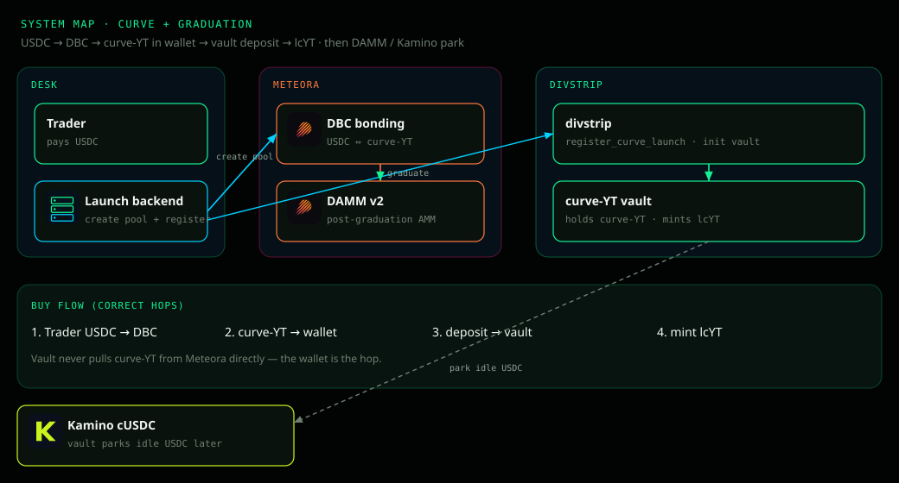

# arancio / orange

Solana workspace for Stocklana: corporate-action registry + DivStrip (PT/YT) +
curve-YT discovery on Meteora DBC → DAMM v2. DivStrip builds on `ca_registry`.

## Toolchain

- Anchor CLI: 1.1.2
- Solana CLI: 3.1.10
- Surfpool: 1.5.0
- Node.js with Yarn 1.x

```bash
yarn install
```

## Reproduce locally (Surfpool + web desk)

**Full step-by-step:** [`REPRODUCE_SURFPOOL.md`](REPRODUCE_SURFPOOL.md)

Covers Surfpool start, deploy, seed `ca_registry` for KOx, launch the web app,
Phantom/Solflare signing, WSL RPC, and wallet funding on the fork.

## Local Test RPC

```bash
./scripts/start-surfpool.sh
```

Tests use `ARANCIO_RPC_URL` when set, otherwise `http://127.0.0.1:8899`.

```bash
# Workspace smoke + immutable vault config
yarn mocha tests/arancio.ts --grep "workspace smoke"

ARANCIO_SURFPOOL_DB=:memory: ./scripts/start-surfpool.sh
ARANCIO_RPC_URL=http://127.0.0.1:8899 \
  yarn mocha -t 1000000 tests/arancio.ts \
  --grep "configuration|named vault|immutable"

# CA registry + CRE sync
ARANCIO_RPC_URL=http://127.0.0.1:8899 \
  yarn mocha -t 180000 tests/ca-registry.ts

yarn test:anchor
```

## Programs

| Program | Role |
|---------|------|
| `ca_registry` | On-chain CA history (kind, cum factors, yield nonces) fed by CRE |
| `divstrip` | Wrap xStock → PT + YT; curve-YT vault / lcYT bridge; redeem |
| `arancio` | Named vault + share mint (ERC-4626 custody deposit) |
| `yield_cusdc` | Local cUSDC stand-in for tests (optional; main path uses Kamino) |

## Architecture (demo)

Interactive versions of these diagrams live on the landing page at
[`/`](web/) → **Architecture** (`#architecture`).

Diagram SVGs (with brand marks) live in [`docs/diagrams/`](docs/diagrams/).
GitHub Mermaid strips `` tags, so the logo-heavy maps are static SVGs below;
sequence diagrams stay as Mermaid.

### 1 — Split path: oracle → contracts → redeem

Users deposit an xStock and receive **strip PT** (capital) + **strip YT** (yield)
for one yield nonce. Chainlink CRE reads the **xStocks API**, labels each CA, and
writes `ca_registry` so DivStrip freezes the right coupon — not raw multiplier noise.



**On-chain pieces (split)**



### 2 — Curve market: DBC, vault, graduation

**curve-YT** is a Meteora discovery token (USDC pair) — not strip YT.
Bonders **swap USDC → curve-YT on DBC**, then **deposit curve-YT into the DivStrip
vault** and receive **lcYT** shares. The vault does **not** pull curve-YT from
Meteora directly — the trader’s wallet is the bridge hop.
Graduation (DBC → DAMM) and strip maturity are **different clocks**.
Idle vault USDC can later park in **Kamino cUSDC**.



**System map (curve + graduation)**



### Two clocks

| Clock | What ends it | Where |
|-------|----------------|-------|
| Bonding / graduation | Quote fill hits migration mcap | Meteora DBC → DAMM |
| Strip maturity | Registry tip passes yield nonce n | DivStrip + `ca_registry` |

## DivStrip web desk

Stocklana-styled landing + strip UI at `http://127.0.0.1:3000` (`yarn web` or `cd web && npm run dev`).

- `/` — overview, **Architecture** diagrams, curve-YT lifecycle, CRE story
- `/app` — Split xStock → PT/YT, launch curve-YT on Meteora DBC, vault buy/sell

Wallets: **Phantom or Solflare** (sign txs in-app). See
[`REPRODUCE_SURFPOOL.md`](REPRODUCE_SURFPOOL.md) for RPC, funding, and registry seed steps.

Meteora curve: initial mcap ≈ f(fair coupon `1 − Yₛ/Yₜ`), migration ≈ 10×, quote **USDC**.
Requires Surfpool `--network mainnet` so DBC program
`dbcij3LWUppWqq96dh6gJWwBifmcGfLSB5D4DuSMaqN` is on the fork.

Vault-side yield park uses **Kamino** main-market cUSDC (users still trade USDC on the desk).
